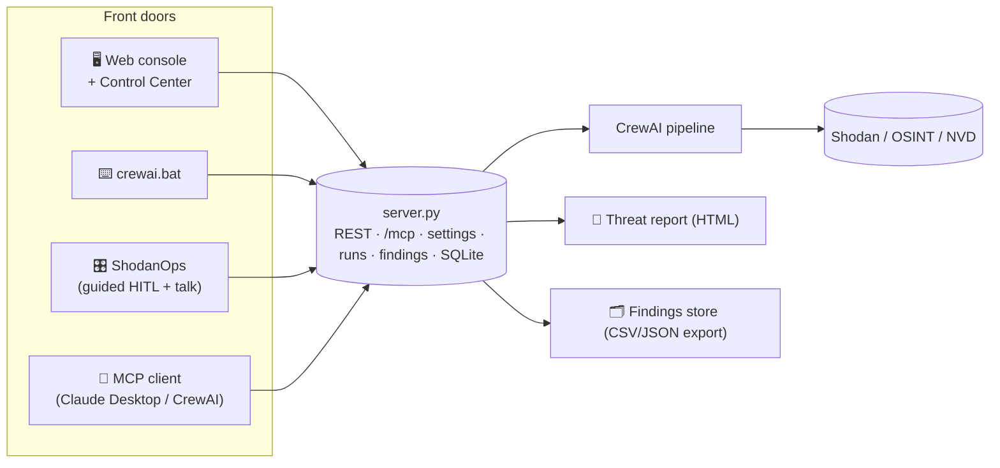
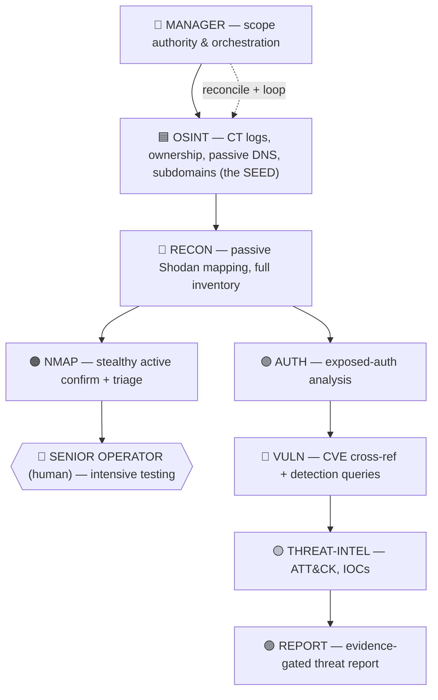

<p align="center">
  
</p>

<p align="center">
  
  
  
  
  
  
  
  
</p>

<p align="center">
  <b>An agentic attack-surface-management console.</b><br/>
  A team of <b>8 AI agents</b> plans Shodan searches from your scope, validates ownership with
  evidence, finds subdomains, confirms live hosts, check OSINT sources, cross-references CVEs, and writes an
  evidence-gated executive threat report — driven from a <b>GUI</b>, the <b>CLI</b>, the new
  <b>ShodanOps</b> human-in-the-loop console, or any <b>MCP client</b>, with <b>4 pipeline
  stages</b>, <b>30 toggleable capability modules</b>, and <b>3 one-click scan profiles</b>.
</p>

```
You set a scope   →   A team of AI agents works it   →   A prioritised threat report
org:"Acme Corp"       MANAGER plans → OSINT seeds →         evidence-gated findings,
net:203.0.113.0/24    RECON/others EXPAND → reconcile →     a full host inventory, and a
                      LOOP until covered → report           hand-off list to test by hand
```

> ⚠️ **Authorized use only.** ShodanSnipe is for infrastructure you own or are explicitly
> contracted to assess. Recon/OSINT/Vuln are passive; the Nmap stage is discovery-only
> (no exploitation, no brute force) and every tool is scope-gated in code.

---

## Contents

1. [What it is](#1-what-it-is)
2. [Architecture](#2-architecture)
3. [The agent team](#3-the-agent-team)
4. [Install](#4-install)
5. [Running — four modes](#5-running--four-modes)
6. [The GUI — views & how to use](#6-the-gui--views--how-to-use)
7. [ShodanOps — guided HITL console + live agent chat](#7-shodanops--guided-hitl-console--live-agent-chat)
8. [Scan profiles & report style](#8-scan-profiles--report-style)
9. [Pick your crew (stages)](#9-pick-your-crew-stages)
10. [Capability modules (30)](#10-capability-modules-30)
11. [Scope: evidence-first (advisor) + cloud-aware](#11-scope-evidence-first-advisor--cloud-aware)
12. [Dynamic, combinatorial query generation](#12-dynamic-combinatorial-query-generation)
13. [Severity model — evidence-gated, not CVSS-inflated](#13-severity-model--evidence-gated-not-cvss-inflated)
14. [Run history & findings store (export anytime)](#14-run-history--findings-store-export-anytime)
15. [Nmap — self-locating, no PATH surgery](#15-nmap--self-locating-no-path-surgery)
16. [Settings, limits & depth knobs](#16-settings-limits--depth-knobs)
17. [The MCP server](#17-the-mcp-server)
18. [Configuration (env)](#18-configuration-env)
19. [Project structure](#19-project-structure)
20. [Troubleshooting](#20-troubleshooting)
21. [Safety model](#21-safety-model)

---

## 1. What it is

ShodanSnipe turns a **scope** (orgs, domains,OSINT,CIDRs, ASNs) into a **prioritised threat report**
by orchestrating a CrewAI team over a FastAPI server that talks to Shodan, an MCP endpoint, and
a local SQLite store.

The pipeline follows one principle end-to-end:
**At a glance:** 8 agents · 4 pipeline stages · 30 capability modules · 3 scan profiles ·
6 MCP tools · 4 front-ends (GUI / CLI / ShodanOps / AI).

---

## 2. Architecture

<p align="center">
  
</p>

The **MANAGER (ASM)** is the spine — it plans, owns scope, drives the loop, and correlates. The
crew prints this at the top of every run (suppress with `CREW_NO_BANNER=1`):

```
0    PLAN ........ scope expansion + hunt plan        (MANAGER)
1    OSINT ....... SEED: certs · ASN · cloud · DNS · WHOIS · subdomains
     RECON ....... EXPAND: Shodan funnel · full inventory
1.5  NMAP ........ live port confirmation (optional)
1.6  RECONCILE ... MANAGER locks scope (final authority)
1.7  LOOP  ↺ ..... refine until coverage is confident
2    AUTH → VULN . exposure + evidence-gated severity
2.5  CORRELATE ... MANAGER cross-agent patterns
2.6  THREAT ...... TTPs · attack chains · IOCs
3    REPORT ...... full inventory · no truncation
```

<details>
<summary>Communication flow as a Mermaid diagram</summary>


</details>

The crew talks to the server over HTTP (REST + `/mcp`); it does **not** import the server.
**Start the server first, then run the crew.**

---

## 3. The agent team



| # | Agent | File | Core job |
|---|-------|------|----------|
| 1 | **Manager (ASM)** | `manager_agent.py` | Plans the hunt, is the **final scope authority** (reconciliation), correlates findings |
| 2 | **OSINT** | `osint_agent.py` | Cert transparency, ownership validation, passive DNS, **subdomain discovery** — **proposes** scope + a broad seed query package |
| 3 | **Recon** | `recon_agent.py` | Passive Shodan mapping; **expands** beyond the seed; emits the **full host inventory** |
| 4 | **Nmap** | `nmap_recon_agent.py` | Stealthy active confirmation + HIGH/MED/LOW triage |
| 5 | **Auth** | `auth_agent.py` | Analyses auth mechanisms on exposed services |
| 6 | **Vuln** | `vuln_agent.py` | CVE cross-reference + scoped detection queries, **evidence-gated severity** |
| 7 | **Threat-Intel** | `threat_intel_agent.py` | ATT&CK mapping, IOC generation |
| 8 | **Report** | `report_agent.py` | Synthesises the executive threat report |

All 8 agents share an **assessment doctrine** (discover-don't-assume, modern-infra focus,
impact-driven scoring, no static checklists) injected into every agent's primary task.

---

## 4. Install

**Prerequisites**
- **Python 3.12** for the crew (CrewAI + `fastmcp` wheels are most reliable here; 3.14 can lack wheels)
- A **Shodan** API key (free tier works)
- An **LLM** key — Anthropic or OpenAI — or local Ollama
- **Nmap** *(optional — only for the active Nmap stage; now auto-located, see §15)*

There are **two environments** because the server and the crew run on different interpreters:
the **server** uses your system Python; the **crew** runs in its own `launchers/crewai_env`
virtualenv (Python 3.12 with CrewAI). Set up both once.

### A) Server environment

```bash
pip install -r requirements.txt
python -c "import importlib.util; print('fastmcp:', importlib.util.find_spec('fastmcp') is not None)"
#   False?  ->  python -m pip install fastmcp     (use the exact python that runs server.py)
```

### B) Crew environment — `crewai_env` (one-time)

**Windows** — the bat does everything:
```bat
cd launchers
setup_crewai.bat        :: creates launchers\crewai_env, installs CrewAI + requests, checks nmap
```

**Linux / macOS** — build it by hand:
```bash
cd launchers
python3.12 -m venv crewai_env          # must be 3.12
source crewai_env/bin/activate
pip install --upgrade pip
pip install "crewai[anthropic]>=1.0" requests   # the [anthropic] extra enables prompt caching (§16)
deactivate
```

**Verify the crew env:**
```bash
launchers/crewai_env/bin/python -c "import crewai, requests; print('crew env OK', crewai.__version__)"   # POSIX
launchers\crewai_env\Scripts\python -c "import crewai, requests; print('crew env OK', crewai.__version__)" # Windows
```

> **ShodanOps runs in the SAME crew venv.** If you launch `shodan_ops.py` with a different Python
> you'll get `No module named 'crewai'` — ShodanOps now detects this and prints the exact venv
> command to use (see §7).

### C) Drop in the crew tools

```
tools/archive_tool.py        # wayback + shodan_host_uri (else poc_crew raises ModuleNotFoundError)
tools/scope_advisor.py       # evidence-based scope advisor + query expander (§11, §12)
tools/subdomain_finder.py    # passive subdomain discovery (§11)
tools/nmap_tool.py           # self-locating nmap wrapper (§15)
tools/doctrine.py            # shared assessment doctrine (injected into all 8 agents)
tools/cached_llm.py          # prompt-cache-aware LLM builder (§16)
```

---

## 5. Running — four modes

Four front doors onto the same engine; all share the same server-side scope and settings.

| Mode | How | When |
|------|-----|------|
| 🖥️ **GUI** | start the server, open the console | Interactive: scope, search, pick crew, read reports |
| ⌨️ **Crew** | run the orchestrator in a second terminal | Run the full assessment pipeline end-to-end |
| 🎛️ **ShodanOps** | `python launchers/shodan_ops.py` | Guided, one-phase-at-a-time HITL; **talk to your agents live** (§7) |
| 🤖 **AI / MCP** | point an MCP client at `http://127.0.0.1:8000/mcp` | Drive the 6 tools from Claude Desktop, Cursor, CrewAI |

**Terminal 1 — the server** (system Python is fine):
```bash
cd core
python server.py          # set SHODANSNIPE_PASSPHRASE to skip the DB prompt
```

**Terminal 2 — the crew** (CrewAI venv):
```bash
source launchers/crewai_env/bin/activate
python launchers/poc_crew.py anthropic        # or: openai | ollama
```
```powershell
cd launchers
crewai.bat anthropic                          # Windows convenience — activates the venv + runs poc_crew
```

The launcher now also **prints recent run history** and **records the current run** at startup, so
terminal runs show up in the same history as GUI launches (§14).

Open the console at **http://127.0.0.1:8000**. Confirm the build with `curl http://127.0.0.1:8000/api/version`.

---

## 6. The GUI — views & how to use

The web console is a **panel workspace**: a top nav bar opens draggable, resizable neon panels.


| Button | Panel | What it's for |
|--------|-------|---------------|
| **AI** | Assistant | Natural-language → Shodan query help, goal-to-query, explanations |
| **Query** | Query builder | Compose/run a Shodan search, pick filters and limits |
| **Results** | Results view | Hosts from your last search — IP, ports, product, risk, in/out-of-scope |
| **History** | Saved searches | Recent queries + result counts; reload a past search |
| **⚙ MCP** | MCP panel | MCP connection + feeds |
| **⚑ CVE** | CVE Intel | Paste an advisory → extracted CVE IDs + scoped detection queries |
| **⊛ Findings** | Findings | Stored crew findings with enriched columns — export CSV/JSON (§14) |
| **◈ Control** | **Control Center** | Profiles, crew, 30 modules, limits, MCP tools, run history, save/run/reset |
| **▤ Report** | **Report** | The latest generated threat report, rendered as HTML |

The normal run is unchanged: add your Shodan key → set scope → **◈ Control** pick a profile +
Save → Run → read **▤ Report**, drill into **Results** / **⊛ Findings**, turn advisories into
queries in **⚑ CVE**.

---

## 7. ShodanOps — guided HITL console + live agent chat

`ShodanOps` runs the crew **one phase at a time**, pausing after each so you stay in the loop —
inspect output, change scope, re-run, branch, or **talk to the agents directly**. It auto-loads
the LLM provider/key from the same place the crew uses, so there's **no per-launch env setup**.

```bash
# launch with the crew venv (the one that has crewai)
launchers/crewai_env/bin/python launchers/shodan_ops.py     # POSIX
launchers\crewai_env\Scripts\python launchers\shodan_ops.py # Windows
```

**Command set**

| Group | Commands |
|-------|----------|
| **Scope** | `scope` · `scope set <IPs/CIDRs/ASNs/domains…>` |
| **Discover / drive** | `query <shodan query>` · `profile` · `run <phase>` · `step` · `pipeline` |
| **Talk (live)** | `talk <message>` (manager) · `talk @<agent> <message>` · `talk reset` |
| **MCP** | `mcp list` · `mcp call <tool> <json>` |
| **Flows** | `flow new/add/save/list/run/show <name>` |
| **Session** | `state` · `next` · `set KEY=VALUE` · `save <file>` · `help` · `quit` |

**Talk to your agents as their manager** — you direct, they answer from the live session context:
```
talk what's the most exposed thing we've found so far?
talk @osint find me live domains for company.com
talk @recon focus the next sweep on the 143.x block, skip the CDN ranges
```
Note the `@` — `talk @osint …` targets OSINT; without it the message goes to the MANAGER.

**Zero-config LLM + robust console.** ShodanOps auto-detects the provider from whichever key is
present (Anthropic → anthropic, OpenAI → openai) and pulls saved keys from the server's LLM
settings, so it "just works" once you've saved a key in the Control Center. A missing key prints
a clear, recoverable message and **returns you to the prompt** — it never exits the console. If
`crewai` isn't in the launching interpreter, it tells you the exact venv command to use.

---

## 8. Scan profiles & report style

Three presets, increasing in depth **and noise/credit use**:

| | **Quick** | **Comprehensive** *(recommended)* | **All modules (deep)** |
|---|---|---|---|
| Posture | 100% passive | passive + light active | fully active |
| Stages | recon → report | recon → nmap → vuln → report | recon → nmap → vuln → report |
| Modules | ~6 (triage) | ~24 | all 30 |
| Limits | results 50, queries 6 | results 100, queries 16 | results 200, queries 24, report 20k |
| For | "what's exposed now?" | normal authorized assessment | final deep pass, small scope |

Pick a profile in **◈ Control** and **Save** (visible at `GET /api/crew/profiles`). For full-surface
coverage on large scopes, raise the depth knob: `GLOBAL_LIMIT_MULTIPLIER=3` (or `GLOBAL_NO_LIMITS=1`).

**Report style** is a *separate* knob from the scan profile — it controls write-up length, not
which stages run: `auto` (default, follows the profile), `brief` (one page), `comprehensive`
(full). Force it with `--report brief|comprehensive` when running `poc_crew.py` directly.

---

## 9. Pick your crew (stages)

| Stage | Key | Skippable | Needs |
|-------|-----|-----------|-------|
| Recon | `recon` | no (always on) | — |
| Nmap | `nmap` | yes | `recon` |
| Vuln | `vuln` | yes | `recon` |
| Report | `report` | yes | — |

Toggle in **◈ Control** and **Save**, or set directly: `set CREW_STAGES=recon,nmap,report`.
`poc_crew.py` reads `CREW_STAGES`/`CREW_MODULES` first, else asks the server — so the GUI and
the CLI behave identically.

---

## 10. Capability modules (30)

**30 capability modules** across the 8 agents, each toggle mapping to a real tool. Core
data-access tools are locked on (🔒) so you can't break the crew.

| Group | Modules |
|-------|---------|
| **Manager** | expand_scope · build_hunt_plan · correlate_findings · **scope_advisor** *(advise + expand)* |
| **Recon** | shodan_search 🔒 · scope_control 🔒 · asn_hunt · dns_posture |
| **OSINT** | cert_transparency · validate_ownership · historical_dns · reverse_whois · cloud_asset_discovery · **find_subdomains** · **scope_advisor** |
| **Nmap** | nmap_discovery · nmap_triage · nmap_scan *(need the Nmap stage)* |
| **Auth** | analyze_auth · classify_posture · json_keyword_scan · probe_sensitive_paths |
| **Vuln** | get_results 🔒 · cve_intel · shodan_host_uri · wayback |
| **Threat Intel** | mitre_attack_lookup · generate_iocs · threat_actor_attribution · red_team_attack_chains |
| **Report** | get_history 🔒 |

New this release: **`scope_advisor`** (evidence-based in/out decisions + the combinatorial query
expander, §11–12) and **`find_subdomains`** (passive multi-source subdomain discovery). Both have
kill-switches (`SCOPE_ADVISOR_TOOL=0`, `SUBDOMAIN_TOOL=0`).

---

## 11. Scope: evidence-first (advisor) + cloud-aware

Scope decisions are made on **evidence, never on naming conventions** — a host whose name doesn't
"look like" the org (an acquired brand, a subsidiary, a cloud/CDN/security-edge tenant) is never
silently dropped. The **`scope_advisor`** tool returns:

- **include** — any solid tie: confirmed CIDR/ASN, a hostname or cert tied to a scope domain, or
  an RDAP org match. **Cloud-hosting is fine** when a hostname/cert tie exists (e.g. an
  `domain.com` host living on `Domain Inc` infrastructure stays in scope).
- **verify** — no tie yet *and* nothing contradicts → **keep it and test it**, never discard.
- **exclude** — only with *positive contrary evidence* (a concrete, unrelated non-edge RDAP org
  and no tie), handed up with the evidence.

**OSINT proposes, the MANAGER decides.** OSINT makes the evidence-based first pass; the manager's
reconciliation step is the **final authority** — it re-checks contested assets with the fuller
recon/nmap picture and can override OSINT. This is the cloud-aware ownership model from before,
now generalised so name mismatches can't cost you real findings.

---

## 12. Dynamic, combinatorial query generation

The OSINT seed package is **dynamic and combinatorial**, not a handful of static easy queries.
`scope_advisor` (action `expand`) cross-products every scope **anchor** (`org`, each `net:<cidr>`)
with every **dimension**:

- **port-groups** — remote-access · databases · mail · web-alt · infra-net · containers · ICS-OT
- **tech components** — WordPress/Jenkins/GitLab/Grafana/Kibana/Tomcat/Citrix/Confluence/…
- **misconfig & exposure** — `Index of /`, exposed `.git`, open buckets, expired certs, 401/403,
  `has_screenshot`, default-cred hints
- **observed products** — each version recon reports (CVE seeding)
- plus high-value pivots (cert-CN, **exposed-origin-behind-CDN**) and the `query_advisor` template
  catalogue (Jenkins/GitLab/K8s/Docker/S3/Swagger/Vault, org-scoped)

A typical two-CIDR scope yields **~130 deduplicated queries**. Recon treats this as a **seed to
expand from** — it adds runtime fingerprint pivots (`jarm`, `ssl.cert.serial`, `http.favicon.hash`,
`http.html_hash`) and the engagement loops until coverage is confident.

---

## 13. Severity model — evidence-gated, not CVSS-inflated

Severity reflects **confirmed impact**, not the max CVSS of a version's CVE list:

- **Critical** requires `confidence: confirmed` **and** confirmed exploitability (probe-proven /
  met exploit conditions). A banner/CPE version alone is **never** Critical.
- **High** — confirmed exposure of a sensitive service, or a CISA-KEV match on a confirmed-exposed
  host (inferred exploitability).
- **Medium** — version-inferred CVEs (banner only), EOL software, hygiene. "OpenSSH 7.4 — 25 CVEs"
  lands here, not Critical; the report cites the 1–3 genuinely exploitable ones and labels the
  rest "version-associated, not individually validated".
- **Severity-confidence coupling** — `inferred` caps at High, `low` caps at Medium.

Every finding carries a mandatory **Evidence** field (what's confirmed vs inferred), **count
integrity** (exec-summary counts equal the enumerated findings), and the inventory is
**discovery-driven** — every discovered host appears, including clean ones (SSH, mail, DNS,
network services), not just the ones that became findings.

---

## 14. Run history & findings store (export anytime)

**Run history** — every run (GUI *or* terminal) is captured to `.shodansnipe_runs.json` and shown
at the top of each launch.
- `GET /api/runs` · `POST /api/runs` (the CLI launcher records itself) · `DELETE /api/runs`

**Findings store** — findings are parsed from each report into structured rows and persisted, so
the GUI can show enriched fields and you can export any time. **Columns are dynamic** — any key on
a finding becomes a column, so adding a field needs no schema change.
- `GET /api/findings` (returns findings **+ the full column set**)
- `POST /api/findings` (record one or a batch) · `DELETE /api/findings`
- `GET /api/findings/export?fmt=csv|json` — export anytime, dynamic columns

Captured fields include: `title · severity · cvss · confidence · asset · evidence · cve · impact ·
fix · control_surface · scope · run_id`.

---

## 15. Nmap — self-locating, no PATH surgery

The Nmap stage is optional and discovery-only. The wrapper now **locates the binary itself**, so
"installed but never detected" is fixed: it searches, in order, `NMAP_PATH` → your `PATH`
(`shutil.which`) → the standard install locations (`C:\Program Files (x86)\Nmap\nmap.exe`,
`C:\Program Files\Nmap\nmap.exe`, `/usr/bin`, `/usr/local/bin`, `/opt/homebrew/bin`, `/snap/bin`),
validating each by running `--version`. It re-resolves lazily at call time, so a PATH that wasn't
ready at import still works.

```bat
:: force the path explicitly if you like
set NMAP_PATH=C:\Program Files (x86)\Nmap\nmap.exe
```

When detected you'll see `[NMAP] Active — binary: <path>`. **SYN scans (`-sS`) still need
Administrator/root** (Npcap on Windows); without it the tool returns a clear `permission_error` and
suggests `intensity=normal` (a `-sV` connect scan, no raw sockets). Hard limits are unchanged: 10
IPs/call, 30 IPs/session, fixed high-risk port list, T2 timing, 60s host timeout.

---

## 16. Settings, limits & depth knobs

| Setting | Default | Controls |
|---------|---------|----------|
| `max_results_per_query` | 100 | results a single `shodan_search` may request |
| `hard_cap_results` | 1000 | absolute ceiling — requests are clamped, never rejected |
| `max_queries_per_run` | 16 | crew query budget per run |
| `credit_budget` | 1000 | Shodan credit awareness for the planner |
| `nmap_max_hosts_per_call` | 50 | Nmap batch size |
| `report_max_tokens` | 20000 | report output length (raise to stop truncation) |
| `report_section_chars` | 60000 | chars of **each** agent's findings fed to the report → how many hosts make it in |
| `result_depth_multiplier` | 1.0 | scales every per-agent cap (see `GLOBAL_LIMIT_MULTIPLIER`) |
| `autonomy_mode` | `hitl` | `hitl` / `scoped` / `full` |

**Depth & loop knobs (env):**
- `GLOBAL_LIMIT_MULTIPLIER=3` — scale every cap ×3 (fuller surface) · `GLOBAL_NO_LIMITS=1` — remove caps
- `LIMIT_<KEY>=N` — override one specific cap (e.g. `LIMIT_RECON_HOSTS`)
- `REFINE_MAX_LOOPS=2` — how many times the reconcile→re-engage loop runs (`--refine` to enable)
- `PROMPT_CACHE=1` — Anthropic prompt caching is automatic with `crewai[anthropic]`; set `0` to disable

Set the GUI knobs in **◈ Control** and **Save**; everything is also a `GET/POST /api/settings` and an env var.

---

## 17. The MCP server

`server.py` mounts a streamable-HTTP MCP endpoint at `http://127.0.0.1:8000/mcp` **in-process**,
exposing **6 tools**: `shodan_search`, `get_results`, `get_scope`, `set_scope`, `get_history`, `cve_intel`.

```json
{ "mcpServers": { "shodansnipe": { "url": "http://127.0.0.1:8000/mcp" } } }
```

> A browser can't speak MCP — a healthy `/mcp` returns **HTTP 406** to an HTML request (that means
> it's mounted). **404** means it's not mounted (install `fastmcp` in the server's interpreter).

---

## 18. Configuration (env)

| Variable | Default | Purpose |
|----------|---------|---------|
| `ANTHROPIC_API_KEY` / `OPENAI_API_KEY` | — | LLM key (ShodanOps also reads saved keys from the server) |
| `LLM_PROVIDER` | *(auto)* | `anthropic` / `openai` / `ollama`; **auto-detected** from the present key if unset |
| `SHODANSNIPE_URL` | `http://127.0.0.1:8000` | URL the crew/ShodanOps talk to |
| `SHODANSNIPE_PASSPHRASE` | *(prompt)* | DB passphrase — set to skip the prompt |
| `CREW_STAGES` / `CREW_MODULES` | *(settings)* | comma lists overriding stages/modules |
| `GLOBAL_LIMIT_MULTIPLIER` / `GLOBAL_NO_LIMITS` / `LIMIT_<KEY>` | — | depth scaling (§16) |
| `REFINE_MAX_LOOPS` | `1` | bounded refine-loop passes (with `--refine`) |
| `PROMPT_CACHE` | `1` | Anthropic prompt caching toggle |
| `REPORT_MAX_TOKENS` / `REPORT_SECTION_CHARS` | *(settings)* | report output / input size |
| `MCP_AUTONOMY_MODE` | `hitl` | `hitl` / `scoped` / `full` |
| `ENABLE_NMAP` | `1` | `0` = passive only / silence the Nmap warning |
| `NMAP_PATH` | *(auto)* | explicit nmap binary path (overrides auto-search, §15) |
| `SCOPE_ADVISOR_TOOL` | `1` | `0` disables the scope advisor + query expander tool |
| `SUBDOMAIN_TOOL` | `1` | `0` disables the subdomain finder tool |
| `CREW_NO_BANNER` | — | `1` suppresses the startup architecture banner |

Most users only ever set the **LLM key** and **Shodan key**. Scope, profile, stages, modules, and
limits are better set in **◈ Control** (persisted server-side). A `.env` next to the launcher is
loaded automatically.

---

## 19. Project structure

```
shodansnipe/
├── _bootstrap.py
├── requirements.txt
│
├── core/
│   ├── server.py            FastAPI: REST · /mcp · settings · /api/version · runs · findings · SQLite · UI
│   ├── settings.py          single source of truth: limits · stages · modules · profiles
│   ├── mcp_tools.py         the 6 MCP tools
│   ├── shodansnipe_core.py  Shodan execution, rate limiting, risk scoring
│   ├── query_advisor.py     Shodan filter reference + template catalogue (feeds the query expander)
│   └── llm.py · threat_feeds.py
│
├── agents/
│   ├── manager_agent.py recon_agent.py osint_agent.py nmap_recon_agent.py
│   ├── auth_agent.py vuln_agent.py threat_intel_agent.py report_agent.py
│   └── example_crew.py example_crew_mcp.py
│
├── tools/
│   ├── shodansnipe_tools.py  search · results · scope · CVE · history
│   ├── scope_advisor.py      evidence-based scope advisor + combinatorial query expander
│   ├── subdomain_finder.py   passive multi-source subdomain discovery
│   ├── nmap_tool.py          self-locating nmap wrapper (discovery + triage + scan)
│   ├── doctrine.py           shared assessment doctrine (injected into all 8 agents)
│   ├── cached_llm.py         prompt-cache-aware LLM builder
│   ├── http_validate_tool.py scope-gated HTTP probe (live confirm, secrets masked)
│   ├── archive_tool.py       WaybackTool + ShodanHostURITool
│   ├── report_render.py      deterministic HTML report renderer
│   └── shodan_query.py
│
├── launchers/
│   ├── poc_crew.py          the production orchestrator (full pipeline)
│   ├── shodan_ops.py        guided HITL console + live agent chat (talk)
│   ├── run_server.bat · crewai.bat · setup_crewai.bat
│   └── crewai_env/          the crew's Python 3.12 virtualenv
│
├── static/                index.html · control_center.html
├── reports/               generated HTML reports
├── README.md              ShodanOps + Nmap quickstart (this doc's companion)
├── assets/                banner.svg · flow.svg · gui.png · crew_panel.png
├── skills/                BUILDING_AGENTS.md · BUILDING_TOOLS.md
└── docs/                  TEAM.md · CREWAI_SETUP.md · STRUCTURE.md
```

---

## 20. Troubleshooting

| Symptom | Cause / Fix |
|---------|-------------|
| ShodanOps: `No module named 'crewai'` | Launched with the wrong Python. Use the **crew venv** — ShodanOps now prints the exact command. |
| ShodanOps exits with `[ERROR] ... API key not set` → `bye.` | Fixed — it now auto-loads the saved key and stays at the prompt. Save your LLM key once in **◈ Control**. |
| `talk osint <msg>` goes to the manager | Use the `@` form: `talk @osint <msg>`. Bare text goes to the MANAGER. |
| `Schema is too complex for compilation` (400) | Too many/complex tool schemas on one agent. The advisor/subdomain tools use minimal schemas; if it recurs, set `SCOPE_ADVISOR_TOOL=0` or `SUBDOMAIN_TOOL=0`. |
| `[NMAP] WARNING: nmap could not be located` | Now auto-searches PATH + standard installs. If it still misses, `set NMAP_PATH=C:\Program Files (x86)\Nmap\nmap.exe`. |
| Nmap runs but no SYN scan | SYN (`-sS`) needs Admin/root + Npcap. Run the terminal as Administrator, or use `intensity=normal`. |
| OSINT lookups empty (bgpview/crt.sh) | Network reachability — those hosts may be blocked by your egress allowlist. The crew degrades gracefully; subdomain finder uses several sources so one block isn't fatal. |
| Report cut off / missing hosts | Raise `report_section_chars` + `report_max_tokens`, or run with `GLOBAL_LIMIT_MULTIPLIER=3`. |
| `404` on `/api/runs`, `/api/findings`, `/api/crew/profiles` | Running an **old `server.py`**. Replace it; confirm with `curl /api/version`. |
| `/mcp` shows `{"detail":"Not Found"}` in a browser | That's a 404 (not mounted). When mounted a browser/curl gets **406** — that's success. |
| `404 model: anthropic/claude-...` | Use `claude-sonnet-4-6` (no `anthropic/` prefix) when `provider="anthropic"`. |

---

## 21. Safety model

- **Scope enforced in code, not just prompts** — tools refuse any host outside the active scope;
  scope decisions are evidence-based and the manager holds final authority.
- **Discovery only** — recon/OSINT/vuln are passive; subdomain discovery is passive (no brute
  force); Nmap is discovery/enumeration; no exploits. Intensive testing stays a human decision.
- **HITL by default** — actions need approval unless you choose Scoped/Full.
- **Audit log always on** — every search, scope change, crew run, and findings export is recorded.

---

<p align="center">
  <sub>Built for <b>SEC598 · SANS Institute</b> — Attack Surface Management + Agentic AI · authorized assessment use only</sub>
</p>
