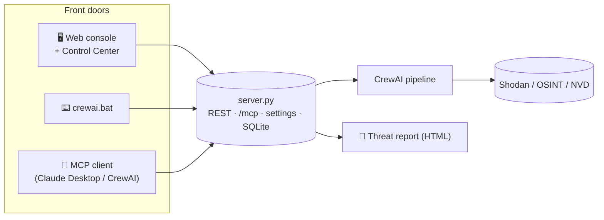
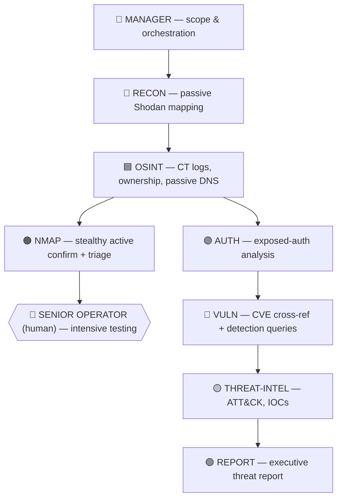
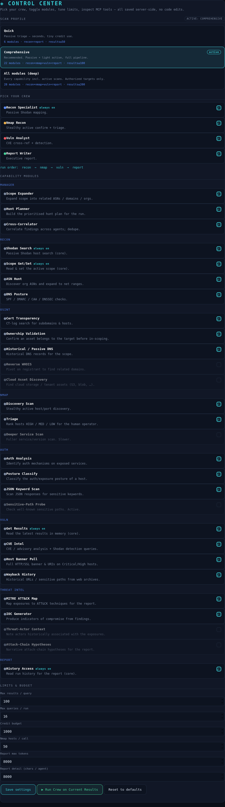
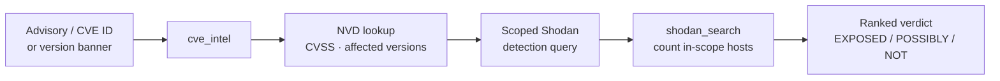

<p align="center">
  
</p>

<p align="center">
  
  
  
  
  
  
  
  
</p>

<p align="center">
  <b>An agentic attack-surface-management console.</b><br/>
  A team of <b>8 AI agents</b> plans Shodan searches from your scope, validates ownership,
  confirms live hosts, cross-references CVEs, and writes an executive threat report — driven
  from a <b>GUI</b>, the <b>CLI</b>, or any <b>MCP client</b>, with <b>4 pipeline stages</b>,
  <b>28 toggleable capability modules</b>, and <b>3 one-click scan profiles</b>.
</p>

```
You set a scope   →   A team of AI agents works it   →   A prioritised threat report
org:"Acme Corp"       Manager · Recon · OSINT · Nmap        + a hand-off list of the hosts
net:203.0.113.0/24    Auth · Vuln · Threat-Intel · Report    a human should test intensively
```

> ⚠️ **Authorized use only.** ShodanSnipe is for infrastructure you own or are explicitly
> contracted to assess. Recon/OSINT/Vuln are passive; the Nmap stage is discovery-only
> (no exploitation, no brute force) and every tool is scope-gated in code.

---

## Contents

1. [What it is](#1-what-it-is)
2. [Architecture](#2-architecture)
3. [The agent team](#3-the-agent-team)
4. [Install](#4-install)
5. [Running — three modes](#5-running--three-modes)
6. [The GUI — views & how to use](#6-the-gui--views--how-to-use)
7. [Scan profiles](#7-scan-profiles)
8. [Pick your crew (stages)](#8-pick-your-crew-stages)
9. [Capability modules (28)](#9-capability-modules-28)
10. [Settings & limits](#10-settings--limits)
11. [CVE detection research](#11-cve-detection-research)
12. [The MCP server](#12-the-mcp-server)
13. [Scope accuracy (cloud-aware)](#13-scope-accuracy-cloud-aware)
14. [Configuration (env)](#14-configuration-env)
15. [Project structure](#15-project-structure)
16. [Troubleshooting](#16-troubleshooting)
17. [Safety model](#17-safety-model)

---

## 1. What it is

ShodanSnipe turns a **scope** (orgs, domains, CIDRs, ASNs) into a **prioritised threat report**
by orchestrating a CrewAI team over a FastAPI server that talks to Shodan, an MCP endpoint, and
a local SQLite store. You decide *how much* runs — from a 30-second passive triage to a full
deep assessment — without editing code.

**At a glance:** 8 agents · 4 pipeline stages · 28 capability modules · 3 scan profiles ·
6 MCP tools · 3 front-ends (GUI / CLI / AI).

---

## 2. Architecture

<p align="center">
  
</p>

<details>
<summary>Same flow as a Mermaid diagram</summary>


</details>

The crew talks to the server over HTTP (REST + `/mcp`); it does **not** import the server.
**Start the server first, then run the crew.**

---

## 3. The agent team



| # | Agent | File | Core job |
|---|-------|------|----------|
| 1 | **Manager** | `manager_agent.py` | Validates scope, plans the hunt, correlates findings |
| 2 | **Recon** | `recon_agent.py` | Passive Shodan attack-surface mapping |
| 3 | **OSINT** | `osint_agent.py` | Cert transparency, ownership validation, passive DNS |
| 4 | **Nmap** | `nmap_recon_agent.py` | Stealthy active confirmation + HIGH/MED/LOW triage |
| 5 | **Auth** | `auth_agent.py` | Analyses auth mechanisms on exposed services |
| 6 | **Vuln** | `vuln_agent.py` | CVE cross-reference + scoped detection queries |
| 7 | **Threat-Intel** | `threat_intel_agent.py` | ATT&CK mapping, IOC generation |
| 8 | **Report** | `report_agent.py` | Synthesises the executive threat report |

---

## 4. Install

**Prerequisites**
- **Python 3.12** (CrewAI + `fastmcp` wheels are most reliable here; 3.14 can lack wheels)
- A **Shodan** API key (free tier works)
- An **LLM** key — Anthropic or OpenAI — or local Ollama
- **Nmap** *(optional — only for the active Nmap stage)*

```bash
# 1) dependencies for the server (fastapi, uvicorn, shodan, fastmcp, …)
pip install -r requirements.txt

# 2) make sure fastmcp is in the SAME interpreter that runs the server
python -c "import importlib.util; print('fastmcp:', importlib.util.find_spec('fastmcp') is not None)"
#   False?  ->  python -m pip install fastmcp     (use the exact python that runs server.py)

# 3) build the crew's 3.12 venv (Windows) — one time
cd launchers && setup_crewai.bat   # creates launchers/crewai_env + installs crewai + nmap check

# 4) drop tools/archive_tool.py into tools/
#    (backs the wayback + shodan_host_uri modules; without it the Vuln agent logs
#     "archive_tool not available" and those two modules are silently off)
```

The server and the crew use **different interpreters**: the server runs on your system Python;
the crew runs in `launchers/crewai_env` (3.12). `setup_crewai.bat` builds that venv — see §5.

**Nmap (optional).** Install only if you want the active stage; otherwise leave the Nmap
stage off and everything else runs. Windows: download the `.exe` and tick *Add to PATH*, or
`choco install nmap`; **reopen the terminal** (PATH refreshes only in new shells); run the
server from an **Administrator** prompt (SYN scans need it). Verify: `nmap --version`.

---

## 5. Running — three modes

Three front doors onto the same engine; all share the same server-side scope and settings.

| Mode | How | When |
|------|-----|------|
| 🖥️ **GUI** | start the server, open the console | Interactive: scope, search, pick crew, read reports |
| ⌨️ **Crew** | run the orchestrator in a second terminal | Run the full assessment pipeline |
| 🤖 **AI / MCP** | point an MCP client at `http://127.0.0.1:8000/mcp` | Drive the 6 tools from Claude Desktop, Cursor, CrewAI |

The **server runs continuously** in one terminal; the **crew is a separate run** in another.
They're separate processes that talk over HTTP (the crew never imports the server), so running
both at once is normal.

**Terminal 1 — the server** (system Python is fine):
```bash
cd core
python server.py          # prompts for a DB passphrase on first run
                          # set SHODANSNIPE_PASSPHRASE to skip the prompt
```

**Terminal 2 — the crew.** It must run in the CrewAI venv (Python 3.12 with `crewai`), which is
*not* the server's interpreter — so activate that venv first, then run the orchestrator:

```bash
# Linux / macOS
source launchers/crewai_env/bin/activate
python launchers/poc_crew.py anthropic        # or: openai | ollama
```
```powershell
# Windows — crewai.bat just does the two steps above for you
cd launchers
crewai.bat anthropic
```

Open the console at **http://127.0.0.1:8000** (the exact URL the server prints — opening
`index.html` as a file breaks the API calls).

> **The `.bat` files are Windows convenience only.** `setup_crewai.bat` builds the venv once;
> `crewai.bat` activates it and runs `poc_crew.py`; `run_server.bat` is just `python server.py`.
> On Linux/macOS (or if you prefer), run the plain commands above — nothing requires the bats.

To make the GUI's **Run Crew** button use the venv, point the server at whichever launcher you use:
```bash
# the server spawns this for /api/crew/run
export CREW_CMD="launchers/crewai_env/bin/python launchers/poc_crew.py anthropic"   # Linux/macOS
set     CREW_CMD=crewai.bat anthropic                                               # Windows
```

**Confirm the server is the current build**:
```bash
curl http://127.0.0.1:8000/api/version
#  -> shows the file path it loaded + every feature route with all_present: true/false
```

---

## 6. The GUI — views & how to use


The web console is a **panel workspace**: a top nav bar opens draggable, resizable neon
panels. Open the console at `http://127.0.0.1:8000` (served by `server.py`).

<p align="center">
  
</p>

### Views (nav-bar panels)

| Button | Panel | What it's for |
|--------|-------|---------------|
| **AI** | Assistant | Natural-language → Shodan query help, goal-to-query, explanations |
| **Query** | Query builder | Compose/run a Shodan search, pick filters and limits |
| **Results** | Results view | The hosts from your last search — IP, ports, product, risk, in/out-of-scope |
| **History** | Saved searches | Recent queries + result counts; reload a past search |
| **⚙ MCP** | MCP panel | MCP connection + feeds |
| **⚑ CVE** | CVE Intel | Paste an advisory → extracted CVE IDs + scoped detection queries |
| **⊛ Findings** | Findings | De-duplicated findings across all your searches |
| **◈ Control** | **Control Center** | Profiles, crew, 28 modules, limits, MCP tools, save/run/reset *(new)* |
| **▤ Report** | **Report** | The latest generated threat report, rendered as HTML *(new)* |

Layout tip: drag a panel by its title bar, resize from the corner handle, **⊞** resets the
layout, and **⊡ Views** / **⊟ WS** save and restore arrangements.

### How to use it — a normal run

1. **Add your Shodan key** (⚙ Config / first-run prompt) and confirm the tier pill shows your plan.
2. **Set your scope** — orgs, domains, CIDRs, ASNs (the crew and all tools are gated to it).
3. **Open ◈ Control**, pick a **profile** (Quick / Comprehensive / All), adjust crew/modules/limits
   if you want, and **Save settings**.
4. **Run** — either click **Run Crew on Current Results** in the Control Center, or run the
   crew from a terminal (see §5). Watch progress in `crew_run.log`.
5. **Read the report** — open **▤ Report**; it shows the latest report the crew posted, as HTML.
6. **Drill in** — use **Results** and **⊛ Findings** to inspect hosts, and **⚑ CVE** to turn
   advisories into detection queries.

For an ad-hoc search without the crew: **Query** → run → review in **Results**.

---

## 6b. The Control Center panel

The Control Center is where you drive everything without touching code. Open it at:

```
http://127.0.0.1:8000/static/control_center.html
```

<p align="center"></p>

**How to use it, top to bottom:**

1. **Scan profile** — click **Quick**, **Comprehensive**, or **All**. This sets the stages,
   modules, and limits in one shot (the active one is highlighted). Start here.
2. **Pick your crew** — toggle the 4 pipeline stages. `recon` is always on; `nmap`/`vuln`
   need `recon` (auto-enabled). The run order updates live.
3. **Capability modules** — 28 toggles grouped by agent. Modules tied to the Nmap stage
   **grey out** when Nmap is off (that's expected — they only run if Nmap runs).
4. **Limits & budget** — results/query, queries/run, credit budget, Nmap host cap, report
   tokens, and **report detail (chars/agent)** (how many hosts make the report).
5. **Buttons** — **Save settings** persists everything server-side · **Run Crew on Current
   Results** launches the pipeline · **Reset to defaults** clears all saved settings.
6. **MCP tools** — a live panel listing the 6 MCP tools and their arguments (reads
   `/api/mcp/tools`), so you can see them without curl.

Everything saves server-side (SQLite, or a local JSON file for CLI-only use) and survives
restarts. Any hand-toggle after picking a profile flips it to *custom*.

> **Embedding in `index.html`:** the Control Center ships as a standalone page. To make it a
> tab in your main UI, add a route (`@app.get("/control")` → `FileResponse(...control_center.html)`)
> and link it, or paste the panel markup into your page.

---

## 7. Scan profiles

Three presets, increasing in depth **and noise/credit use**. Pick in the GUI or `--profile`.

| | **Quick** | **Comprehensive** *(recommended)* | **All modules (deep)** |
|---|---|---|---|
| Posture | 100% passive | passive + light active | fully active |
| Stages | recon → report | recon → nmap → vuln → report | recon → nmap → vuln → report |
| Modules | ~6 (triage) | ~22 | all 28 |
| Limits | results 50, queries 6 | results 100, queries 16 | results 200, queries 24, report 12k |
| Time / credits | seconds, tiny | minutes, moderate | slowest, highest |
| For | "what's exposed now?" | normal authorized assessment | final deep pass, small authorized scope |

Pick a profile in the **◈ Control** panel (Quick / Comprehensive / All) and **Save**. The
choice is stored server-side and the crew honours it on the next run. The active
profile is also visible at `GET /api/crew/profiles`.

> **All** turns on the genuinely active capabilities (`nmap_scan`, `probe_sensitive_paths`,
> `cloud_asset_discovery`) and the heaviest credit users (`shodan_host_detail`, `cve_intel`,
> `asn_hunt`). Run it only against assets you may actively touch, keep autonomy on **HITL**,
> and set `credit_budget` high enough that the planner doesn't stall mid-run.

---

## 8. Pick your crew (stages)

Run only the **4 pipeline stages** you want — full agent, not all-or-nothing.

| Stage | Key | Skippable | Needs |
|-------|-----|-----------|-------|
| Recon | `recon` | no (always on) | — |
| Nmap | `nmap` | yes | `recon` |
| Vuln | `vuln` | yes | `recon` |
| Report | `report` | yes | — |

Toggle stages in the **◈ Control** panel and **Save**. The selection is passed to the crew as
`CREW_STAGES=...` (e.g. `recon,report` to skip Nmap and Vuln), which `poc_crew.py` reads and
maps onto its `--no-nmap` / agent flags — so the GUI and the crew behave identically. You
can also set it directly:

```bat
set CREW_STAGES=recon,report      :: then run the crew
```

---

## 9. Capability modules (28)

Finer-grained than stages: **28 capability modules** across the **8 agents**, each toggle
mapping to a real tool. Core data-access tools (search/scope/results/history) are shown but
**locked on** so you can't break the crew.

| Group | Modules |
|-------|---------|
| **Manager** | expand_scope · build_hunt_plan · correlate_findings |
| **Recon** | shodan_search 🔒 · scope_control 🔒 · asn_hunt · dns_posture |
| **OSINT** | cert_transparency · validate_ownership · historical_dns · reverse_whois · cloud_asset_discovery |
| **Nmap** | nmap_discovery · nmap_triage · nmap_scan *(need the Nmap stage)* |
| **Auth** | analyze_auth · classify_posture · json_keyword_scan · probe_sensitive_paths |
| **Vuln** | get_results 🔒 · cve_intel · shodan_host_uri · wayback |
| **Threat Intel** | mitre_attack_lookup · generate_iocs · threat_actor_attribution · red_team_attack_chains |
| **Report** | get_history 🔒 |

Toggle them in the Control Center (grouped by agent) or via `CREW_MODULES=...`. Defaults:
standard discovery on; heavier/active ones (cloud assets, reverse WHOIS, deeper Nmap,
sensitive-path probe, threat-actor context, attack-chain hypotheses) off.

---

## 10. Settings & limits

Everything that used to be a hard-coded magic number is now a setting — edited in the GUI
or CLI, persisted server-side, no code edits.

| Setting | Default | Controls |
|---------|---------|----------|
| `max_results_per_query` | 100 | results a single `shodan_search` may request |
| `hard_cap_results` | 1000 | absolute ceiling — requests are **clamped**, never rejected |
| `max_queries_per_run` | 16 | crew query budget per run |
| `credit_budget` | 1000 | Shodan credit awareness for the planner |
| `nmap_max_hosts_per_call` | 50 | Nmap batch size |
| `report_max_tokens` | 8000 | report output length (raise to stop truncation) |
| `report_section_chars` | 8000 | chars of **each** agent's findings fed to the report → **how many hosts make it in** |
| `autonomy_mode` | `hitl` | `hitl` / `scoped` / `full` |

Set these in the **◈ Control** panel's limits grid and **Save** (or **Reset to defaults**).
Programmatically: `GET/POST /api/settings` and `POST /api/settings/reset`. Every knob is also
an env var the crew reads (`SHODAN_MAX_RESULTS`, `REPORT_SECTION_CHARS`, `CREW_STAGES`,
`CREW_MODULES`, …):

```bat
set SHODAN_MAX_RESULTS=200
set REPORT_SECTION_CHARS=16000   :: then run the crew
```

---

## 11. CVE detection research

The Vuln agent doesn't just *list* CVEs — it turns advisories into **scoped Shodan detection
queries** and counts affected hosts.



1. **Extract** CVE IDs + version strings from recon/auth findings.
2. **Enrich** via `cve_intel` (server `/api/llm/cve-intel`, NVD fallback): CVSS, affected versions, exploitability.
3. **Detect** — build a *scoped* query (e.g. `net:203.0.113.0/24 product:"WebLogic"`) and run it.
4. **Triage** — rank Critical/High/Medium, flag `confirmed` vs version-`inferred`.

It also flags no-CVE-but-dangerous exposures (Telnet, unauth Docker/Redis/Mongo/Elastic, exposed
DBs). **Detection only — it confirms exposure, never exploits it.**

---

## 12. The MCP server

`server.py` mounts a streamable-HTTP MCP endpoint at `http://127.0.0.1:8000/mcp` **in-process**,
exposing **6 tools**: `shodan_search`, `get_results`, `get_scope`, `set_scope`, `get_history`, `cve_intel`.

**Claude Desktop / Cursor:**
```json
{ "mcpServers": { "shodansnipe": { "url": "http://127.0.0.1:8000/mcp" } } }
```

**See the tools without curl:** the Control Center's MCP panel lists them (via `/api/mcp/tools`).

> A browser can't speak MCP — a healthy `/mcp` returns **HTTP 406** (or a JSON-RPC
> "Not Acceptable: client must accept text/event-stream") to an HTML request. That 406 means
> it's mounted and working. **404** means it's not mounted (install `fastmcp` in the server's
> interpreter). Test: `curl -i http://127.0.0.1:8000/mcp/`.

---

## 13. Scope accuracy (cloud-aware)

A target's assets often live on AWS/Azure/GCP/Cloudflare, where the IP block is registered to
the **cloud provider**, not the org. RDAP/ASN therefore can't decide ownership there. The
`validate_ownership` tool is **cloud-aware**:

- On a hyperscaler/CDN block → verdict `cloud-hosted` (neutral) — **kept**, not dropped.
- If a hostname/cert ties the IP to a scope domain → `confirmed` (in-scope) even on AWS.
- A dedicated block with no match → `out-of-scope`, so scope stays tight (no sweeping in
  unrelated cloud tenants).

This is why an AWS-hosted box that's genuinely the org's no longer vanishes from the report.

---

## 14. Configuration (env)

| Variable | Default | Purpose |
|----------|---------|---------|
| `ANTHROPIC_API_KEY` / `OPENAI_API_KEY` | — | LLM key |
| `LLM_PROVIDER` | `anthropic` | `anthropic` / `openai` / `ollama` |
| `SHODANSNIPE_URL` | `http://127.0.0.1:8000` | URL the crew talks to |
| `SHODANSNIPE_PASSPHRASE` | *(prompt)* | DB passphrase — set to skip the prompt |
| `CREW_STAGES` / `CREW_MODULES` | *(settings)* | comma lists overriding stages/modules |
| `SHODAN_MAX_RESULTS` / `CREW_MAX_QUERIES` / `REPORT_SECTION_CHARS` | *(settings)* | override limits |
| `MCP_AUTONOMY_MODE` | `hitl` | `hitl` / `scoped` / `full` |
| `ENABLE_NMAP` | `1` | `0` = passive only / silence the Nmap warning |

### Setting environment variables

Set the LLM key (and any overrides) **in the terminal that runs the crew**. Two scopes:
*session* (this terminal only) and *persistent* (every new terminal).

**Linux / macOS**
```bash
# session — current shell only
export ANTHROPIC_API_KEY="sk-ant-..."
export LLM_PROVIDER="anthropic"

# persistent — add the same lines to ~/.bashrc or ~/.zshrc, then:
source ~/.bashrc
```

**Windows — PowerShell**
```powershell
# session — current window only
$env:ANTHROPIC_API_KEY = "sk-ant-..."
$env:LLM_PROVIDER = "anthropic"

# persistent — survives reboots, applies to new windows
[System.Environment]::SetEnvironmentVariable("ANTHROPIC_API_KEY","sk-ant-...","User")
```

**Windows — Command Prompt (cmd.exe)**
```bat
set ANTHROPIC_API_KEY=sk-ant-...        :: session only
setx ANTHROPIC_API_KEY "sk-ant-..."     :: persistent (open a NEW window to use it)
```

**A `.env` file (any OS)** — drop a `.env` next to the launcher with `KEY=value` lines; it's
loaded automatically (python-dotenv is installed). Keep it out of git.
```
ANTHROPIC_API_KEY=sk-ant-...
LLM_PROVIDER=anthropic
SHODANSNIPE_PASSPHRASE=your-passphrase
```

> Most users only ever set the **LLM key**. Scope, profile, stages, modules, and limits are
> better set in the **◈ Control** panel — they persist server-side and the crew reads them, so
> you don't need the `CREW_*` / `SHODAN_MAX_RESULTS` env vars unless you're scripting headless runs.

---

## 15. Project structure

```
shodansnipe/
├── _bootstrap.py          import-path setup — every launcher imports this first
├── requirements.txt
│
├── core/                  the engine (rarely changes)
│   ├── server.py            FastAPI: REST · /mcp · settings · /api/version · SQLite · serves UI
│   ├── settings.py          single source of truth: limits · stages · 28 modules · profiles
│   ├── mcp_tools.py         the 6 MCP tools (+ list_manifest for the UI viewer)
│   ├── shodansnipe_core.py  Shodan execution, rate limiting, risk scoring
│   └── llm.py · threat_feeds.py
│
├── agents/                one file per team member (build_*_agent / build_*_tasks)
│   ├── manager_agent.py recon_agent.py osint_agent.py nmap_recon_agent.py
│   ├── auth_agent.py vuln_agent.py threat_intel_agent.py report_agent.py
│   └── example_crew.py example_crew_mcp.py
│
├── tools/
│   ├── shodansnipe_tools.py  search · results · scope · CVE · history
│   ├── archive_tool.py       WaybackTool + ShodanHostURITool  (backs wayback / shodan_host_uri)
│   ├── report_render.py      deterministic HTML report renderer
│   └── shodan_query.py · nmap_tool.py
│
├── launchers/             entry points you run
│   ├── poc_crew.py          the production orchestrator (full pipeline)
│   ├── run_server.bat       start the server (run first)
│   ├── crewai.bat           run the crew (reads scope + mode from the server)
│   ├── setup_crewai.bat     one-time: build crewai_env (3.12) + deps + nmap check
│   └── crewai_env/          the crew's Python 3.12 virtualenv
│
├── static/                index.html  ·  control_center.html  (the Control Center)
├── reports/               generated HTML reports (served at /api/report/latest)
├── assets/                banner.svg · flow.svg · gui.png · crew_panel.png
├── skills/                BUILDING_AGENTS.md · BUILDING_TOOLS.md
└── docs/                  TEAM.md · CREWAI_SETUP.md · STRUCTURE.md
```

> Place `settings.py` wherever `server.py` imports it from — in this layout that's `core/`.
> If you keep it beside `server.py`, the import just works.

---

## 16. Troubleshooting

| Symptom | Cause / Fix |
|---------|-------------|
| `404` on `/api/crew/profiles`, `/api/mcp/tools`, `/api/settings/reset` | Running an **old `server.py`**. Replace it; confirm with `curl /api/version` → `all_present: true`. Watch the Beta-vs-Prod tree trap. |
| `/mcp` shows `{"detail":"Not Found"}` in a browser | That's a 404 (not mounted). When mounted, a browser/curl gets **406** — that's success. |
| `MCP endpoint disabled — No module named 'fastmcp'` | `fastmcp` isn't in the server's interpreter. `python -m pip install fastmcp` using the exact python that runs `server.py`. On 3.14 with no wheel, run the server on **3.12**. |
| Control Center toggles don't change crew behaviour | Settings save + travel as env, but `poc_crew.py` / `shodansnipe_tools.py` must **read** `CREW_STAGES`/`CREW_MODULES`/limits (see `docs/WIRING.md`). Until wired, the crew runs defaults. |
| `[NMAP] binary not found` | Nmap not installed/on PATH. Install + reopen terminal as Admin, or leave the Nmap stage off / `ENABLE_NMAP=0`. |
| `[VulnAgent] archive_tool not available` | `tools/archive_tool.py` missing — add it; the `wayback` + `shodan_host_uri` modules depend on it. |
| `api.host(...) failed: No information available` | Expected — Shodan has no record for that IP (common on CloudFront/CDN edges). Harmless; `ShodanHostURITool` returns "no data". |
| AWS-hosted target host dropped from scope | Fixed by cloud-aware `validate_ownership` (§13). Pass `hostnames` + `scope_domains` to confirm cloud assets. |
| Report cut off / missing hosts | Raise `report_section_chars` (input) and/or `report_max_tokens` (output) in the Control Center. |
| `404 model: anthropic/claude-...` | Use `claude-sonnet-4-6` (no `anthropic/` prefix) when `provider="anthropic"`. |

Full guide: `docs/TROUBLESHOOTING.md`.

---

## 17. Safety model

- **Scope enforced in code, not just prompts** — tools refuse any host outside the active scope.
- **Discovery only** — recon/OSINT/vuln are passive; Nmap is discovery/enumeration; no exploits,
  no brute force. Intensive testing stays a human decision.
- **HITL by default** — actions need approval unless you choose Scoped/Full.
- **Audit log always on** — every search, scope change, and crew run is recorded.

---

<p align="center">
  <sub>Built for <b>SEC598 · SANS Institute</b> — Attack Surface Management + Agentic AI · authorized assessment use only</sub>
</p>
