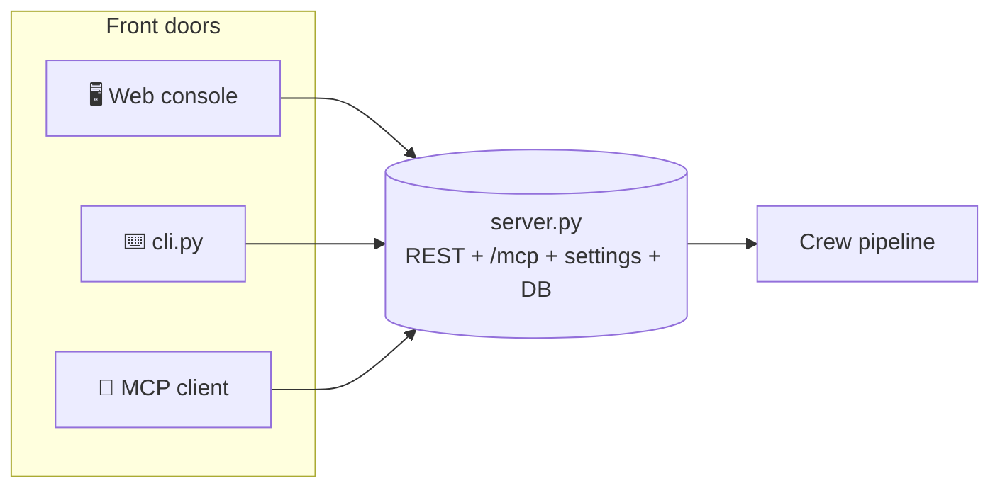
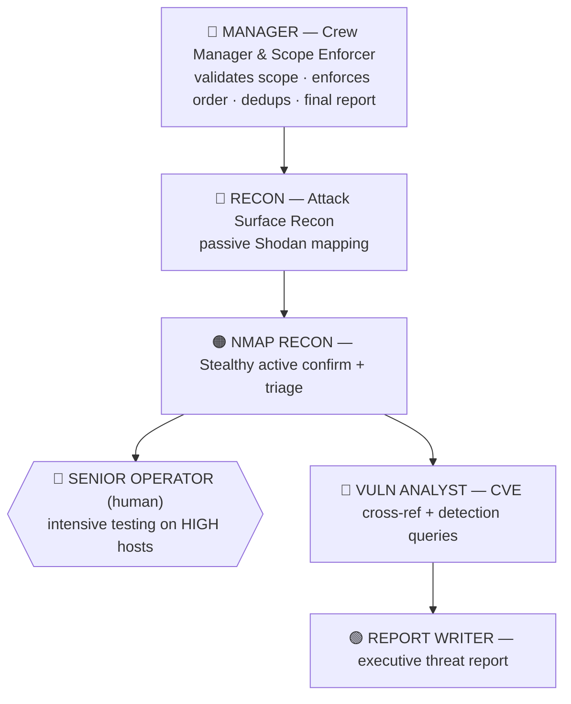
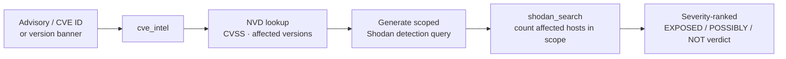

<p align="center">
  
</p>

<p align="center">
  
  
  
  
  
  
</p>

<p align="center">
  <b>An agentic attack-surface-management console.</b><br/>
  A CrewAI team plans Shodan searches from your scope, confirms what's live with stealthy
  Nmap, triages hosts for a human specialist, cross-references CVEs, and writes an executive
  threat report — with human-in-the-loop controls and <b>granular, pick-your-crew</b> stage selection.
</p>

```
You set a scope   →   A team of AI agents works it   →   A prioritised threat report
org:"Acme Corp"       Recon → Nmap → Vuln → Report        + a hand-off list of the hosts
net:203.0.113.0/24    (you choose which stages run)        a human should test intensively
```

> ⚠️ **Authorized use only.** ShodanSnipe is for scanning infrastructure you own or are
> explicitly contracted to assess. The active-recon stage is discovery/enumeration only —
> no exploitation, no brute force — and stays scope-gated in code.

---

## Contents

- [Three ways to run it](#three-ways-to-run-it)
- [Quick start](#quick-start)
- [The agent team](#the-agent-team)
- [Pick your crew](#pick-your-crew)
- [Scan profiles](#scan-profiles)
- [Settings &amp; limits (no code edits)](#settings--limits-no-code-edits)
- [CVE detection research](#cve-detection-research)
- [The MCP server](#the-mcp-server)
- [Project structure](#project-structure)
- [Configuration](#configuration)
- [Troubleshooting](#troubleshooting)
- [Safety model](#safety-model)

---

## Three ways to run it

The same engine, three front doors — pick whichever fits the moment.

| Mode | Command | When to use |
|------|---------|-------------|
| 🖥️ **GUI** | `python cli.py serve` → open `http://127.0.0.1:8000` | Interactive: set scope, run searches, pick your crew, read reports |
| ⌨️ **CLI** | `python cli.py crew --stages recon,vuln,report` | Scripted/headless runs, CI, or when you live in the terminal |
| 🤖 **AI / MCP** | point Claude Desktop / Cursor / CrewAI at `http://127.0.0.1:8000/mcp` | Drive the tools from any MCP client — six tools auto-discovered |

All three read the **same** server-side settings and scope, so a choice you make in the GUI
is honoured by the CLI and the MCP client.



---

## Quick start

**Prerequisites:** Python **3.12** (CrewAI wheel compatibility), a Shodan API key (free works),
and an LLM key (Anthropic / OpenAI) or local Ollama. `nmap` only for the active-recon stage.

```bash
pip install -r requirements.txt        # fastapi, uvicorn, shodan, crewai, fastmcp, …

# 1) start the console + MCP (one process, serves REST, /mcp and the UI)
python cli.py serve                     # or:  python server.py
#    set SHODANSNIPE_PASSPHRASE to skip the DB passphrase prompt

# 2) open the console, set your scope + API key
#    http://127.0.0.1:8000

# 3) run the crew — from the UI button, or:
python cli.py crew --provider anthropic --stages recon,vuln,report
```

---

## The agent team



| Agent | File | Tools | Output |
|-------|------|-------|--------|
| **Recon Specialist** | `agents/recon_agent.py` | `shodan_search`, `set_scope`, `get_scope` | in-scope live hosts + risk |
| **Nmap Recon** | `agents/nmap_recon_agent.py` | `nmap_discovery_scan`, `nmap_triage` | HIGH/MED/LOW hand-off |
| **Vuln Analyst** | `agents/vuln_agent.py` | `cve_intel`, `shodan_search`, `get_results` | CVE detection queries + verdict |
| **Report Writer** | `agents/report_agent.py` | `get_results`, `get_history` | executive threat report |

Every agent is a standalone module exporting `build_<name>_agent(llm)` and
`build_<name>_tasks(...)` — reusable and individually runnable. See [`docs/TEAM.md`](docs/TEAM.md).

---

## Pick your crew

You don't have to run the whole pipeline. Enable exactly the stages you want — from the
**Crew &amp; Limits** panel in the UI, or the CLI. Dependencies resolve automatically
(`vuln` and `nmap` pull in `recon`; `recon` is always on), and the run order is preserved.

<p align="center"></p>

```bash
python cli.py stages                      # list stages + current state
python cli.py stages --set recon,report   # e.g. skip Nmap and Vuln
python cli.py crew --stages recon,vuln --max-results 200
```

| Stage | Key | Skippable | Needs |
|-------|-----|-----------|-------|
| Recon Specialist | `recon` | no (always on) | — |
| Nmap Recon | `nmap` | yes | `recon` |
| Vuln Analyst | `vuln` | yes | `recon` |
| Report Writer | `report` | yes | — |

Under the hood the choice becomes `CREW_STAGES=recon,vuln,report` in the crew's environment,
so the GUI button, `cli.py`, and `crewai.bat` all behave identically.

---

## Settings &amp; limits (no code edits)

Limits that used to be hard-coded (the `le=100` cap, the credit budget, Nmap host caps,
report token ceiling) are now **one settings layer** — edit them in the UI or CLI, persisted
server-side. No more changing source to raise a result limit.

```bash
python cli.py settings                                        # show all tunables
python cli.py settings --set max_results_per_query=200 report_max_tokens=12000
```

| Setting | Default | Controls |
|---------|---------|----------|
| `max_results_per_query` | 100 | results a single `shodan_search` may request |
| `hard_cap_results` | 1000 | absolute ceiling — requests are **clamped**, never rejected |
| `max_queries_per_run` | 16 | crew query budget per run |
| `credit_budget` | 1000 | Shodan credit awareness for the planner |
| `nmap_max_hosts_per_call` | 50 | Nmap batch size |
| `report_max_tokens` | 8000 | raise to stop long reports truncating |
| `autonomy_mode` | `hitl` | `hitl` / `scoped` / `full` |

REST: `GET/POST /api/settings`, `GET/POST /api/crew/stages`. Every knob is also an env var
(`SHODAN_MAX_RESULTS`, `CREW_MAX_QUERIES`, `REPORT_MAX_TOKENS`, `CREW_STAGES`, …) for headless use.

---

## Scan profiles

Three one-click presets set the stages, modules, and limits together — pick one in the
Control Center, or pass `--profile` on the CLI. They trade depth/noise against speed and
Shodan-credit use.

| | **Quick** | **Comprehensive** *(recommended)* | **All modules (deep)** |
|---|---|---|---|
| **Posture** | 100% passive | passive + light active | fully active |
| **Stages** | recon → report | recon → nmap → vuln → report | recon → nmap → vuln → report |
| **Modules** | ~6 (triage) | ~22 | all 28 |
| **Limits** | results 50, queries 6 | results 100, queries 16 | results 200, queries 24, report 12k |
| **Time / credits** | seconds, tiny | minutes, moderate | slowest, highest |
| **For** | "what's exposed now?" | normal authorized assessment | final deep pass on a small, fully-authorized scope |

```bash
python cli.py profiles                       # list them + show the active one
python cli.py crew --profile quick           # triage
python cli.py crew --profile comprehensive   # the usual run
python cli.py crew --profile all             # deep — authorized active targets only
```

> **Quick → Comprehensive → All** is also the order of increasing *noise*. The jump to **All**
> turns on the genuinely active capabilities (`nmap_scan`, `probe_sensitive_paths`,
> `cloud_asset_discovery`) and the heaviest credit users (`shodan_host_uri`, `cve_intel`,
> `asn_hunt`). Run **All** only against assets you're authorized to actively touch, keep
> autonomy on **HITL**, and make sure `credit_budget` is set high enough that the planner
> doesn't hit the ceiling mid-run. Any hand-toggle after picking a profile flips it to *custom*.

---

## CVE detection research

The Vuln Analyst doesn't just *list* CVEs — it turns advisories into **Shodan detection
queries** and runs them to find affected hosts in your scope.



How it works:

1. **Extract** — every CVE ID, plus version strings and products with known histories, is pulled
   from recon/auth findings.
2. **Enrich** — `cve_intel` looks each up (server `/api/llm/cve-intel`, with an NVD fallback): CVSS,
   affected versions, whether it's remotely exploitable.
3. **Detect** — it builds a *scoped* Shodan query (e.g. `net:203.0.113.0/24 product:"WebLogic"`)
   and runs it, counting in-scope matches.
4. **Triage** — findings are ranked Critical/High/Medium and flagged with confidence
   (`confirmed` vs version-`inferred`), because a version-inferred CVE is a candidate, not a fact.

It also flags exposures that have **no CVE** but are inherently dangerous (Telnet, unauthenticated
Docker/Redis/Mongo/Elastic, Kubernetes API, exposed databases). Paste any advisory into the
**CVE Intel** panel to get extracted IDs + ready-to-run detection queries.

> Detection only. The analyst confirms *exposure*, never exploits it.

---

## The MCP server

`server.py` exposes a streamable-HTTP MCP endpoint at `http://127.0.0.1:8000/mcp` — **in the
same process**, no separate script — with six tools: `shodan_search`, `get_results`,
`get_scope`, `set_scope`, `get_history`, `cve_intel`.

**Claude Desktop / Cursor / Windsurf:**
```json
{ "mcpServers": { "shodansnipe": { "url": "http://127.0.0.1:8000/mcp" } } }
```

**CrewAI (auto tool discovery):** see [`agents/example_crew_mcp.py`](agents/example_crew_mcp.py).

> A browser can't test `/mcp` — even when healthy it returns HTTP 406 to an HTML request.
> Verify with `curl -i http://127.0.0.1:8000/mcp/` (anything but 404 = mounted).

---

## Project structure

```
shodansnipe/
├── cli.py                 ⌨️  unified entry: serve · crew · stages · settings
├── settings.py            ⚙️  single source of truth: limits + pick-your-crew
├── requirements.txt
│
├── core/
│   ├── server.py          FastAPI: REST + /mcp + settings + DB + serves the UI
│   ├── mcp_tools.py        the six MCP tools (proxy the REST routes)
│   ├── shodansnipe_core.py Shodan execution, rate limiting, risk scoring
│   ├── llm.py              goal→query, CVE intel, summarise
│   └── threat_feeds.py     C2 / STIX-TAXII feed crawler
│
├── agents/                one file per team member (build_*_agent / build_*_tasks)
│   ├── recon_agent.py  nmap_recon_agent.py  vuln_agent.py  report_agent.py
│   └── example_crew.py  example_crew_mcp.py
│
├── tools/
│   ├── shodansnipe_tools.py  search · results · scope · CVE · history
│   ├── shodan_query.py       escaping + strict scope matcher + protocol/version catalog
│   ├── report_render.py      deterministic HTML report (never truncates)
│   └── nmap_tool.py          NmapDiscoveryTool · NmapTriageTool
│
├── launchers/             poc_crew.py · crewai.bat · setup_crewai.bat
├── static/                index.html  ·  settings_panel.html (Crew & Limits)
├── assets/                banner.svg  ·  crew_panel.png
└── docs/                  TEAM.md · CREWAI_SETUP.md · TROUBLESHOOTING.md · sec598_submission.md
```

> The crew talks to the server over HTTP (REST + `/mcp`) — it does **not** import the server.
> Start the server first, then run the crew.

---

## Configuration

| Variable | Default | Purpose |
|----------|---------|---------|
| `ANTHROPIC_API_KEY` / `OPENAI_API_KEY` | — | LLM key (set before the crew) |
| `LLM_PROVIDER` | `anthropic` | `anthropic` / `openai` / `ollama` |
| `SHODANSNIPE_URL` | `http://127.0.0.1:8000` | server URL the crew talks to |
| `SHODANSNIPE_PASSPHRASE` | *(prompt)* | DB passphrase — set to skip the prompt |
| `CREW_STAGES` | *(all)* | comma list, e.g. `recon,vuln,report` |
| `SHODAN_MAX_RESULTS` / `CREW_MAX_QUERIES` / `REPORT_MAX_TOKENS` | *(settings)* | override limits |
| `MCP_AUTONOMY_MODE` | `hitl` | `hitl` / `scoped` / `full` |
| `ENABLE_NMAP` | `1` | `0` = passive Shodan only (same as dropping `nmap` from the crew) |
| `CREW_CMD` | *(auto)* | override the launcher the UI button spawns |

Full walkthrough: [`docs/CREWAI_SETUP.md`](docs/CREWAI_SETUP.md).

---

## Troubleshooting

| Symptom | Fix |
|---------|-----|
| `{"detail":"Not Found"}` at `/mcp` in a browser | Normal — browsers can't speak MCP. Use `curl -i …/mcp/`; the crew connects fine |
| Button / `/api/crew/run` 404 | Old `server.py` with `uvicorn.run()` mid-file — use the current one (entry block is at the end) |
| `ModuleNotFoundError: db / scope / settings` | Launch-dir issue — the current `server.py` adds its own dir to `sys.path`; keep modules beside it |
| `limit must be <= 100` | Fixed — limits now clamp via `settings.py`; raise `max_results_per_query` in the UI |
| `404 model: anthropic/claude-...` | Use `claude-sonnet-4-6` (no `anthropic/` prefix) when `provider="anthropic"` |
| `[NMAP] disabled` | Install `nmap` + run as admin, or just drop `nmap` from your crew |

Full guide: [`docs/TROUBLESHOOTING.md`](docs/TROUBLESHOOTING.md).

---

## Safety model

- **Scope enforced in code, not just prompts** — tools refuse any IP/host outside the active scope.
- **Active recon is discovery only** — no exploits, no brute force, no intrusive scripts. The
  intensive-testing decision always stays with the human operator.
- **HITL by default** — every action needs approval unless you explicitly choose Scoped/Full.
- **Audit log always on** — every search, scope change, and crew run is recorded.

---

<p align="center">
  <sub>Built for <b>SEC598 · SANS Institute</b> — Attack Surface Management + Agentic AI · authorized assessment use only</sub>
</p>
